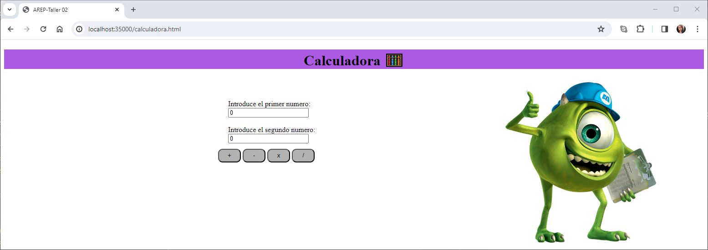
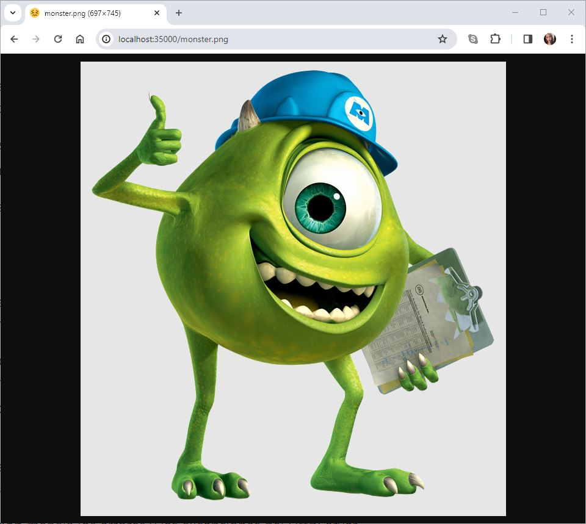
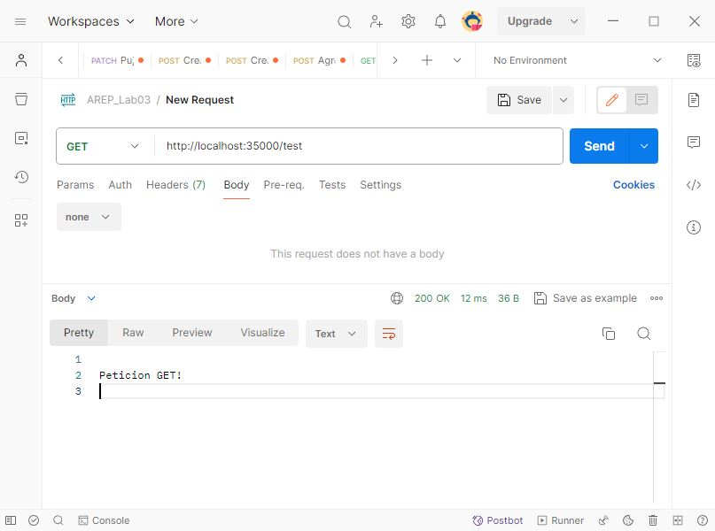
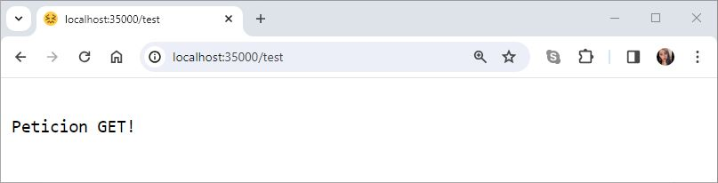
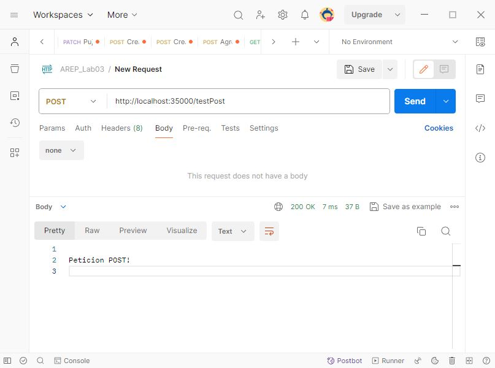

# TALLER 4: Arquitecturas de servidores de aplicaciones, meta protocolos de objetos, patrón IOC y reflexión.

Se construyo un servidor Web (tipo Apache) en Java, el cual es capaz de entregar páginas html e imágenes tipo PNG. Este servidor provee un framework IoC para la construcción de aplicaciones web a partir de POJOS. Asi mismo se ha desarrollado un prototipo mínimo que demuestra las capacidades reflexivas de Java y permite cargar al menos un bean (POJO), derivando así una aplicación web a partir de él.

---
### Prerrequisitos

* [Maven](https://maven.apache.org/): Es una herramienta de comprensión y gestión de proyectos de software. Basado en el concepto de modelo de objetos de proyecto (POM), Maven puede gestionar la construcción, los informes y la documentación de un proyecto desde una pieza de información central.

* [Git](https://learn.microsoft.com/es-es/devops/develop/git/what-is-git): Es un sistema de control de versiones distribuido, lo que significa que un clon local del proyecto es un repositorio de control de versiones completo. Estos repositorios locales plenamente funcionales permiten trabajar sin conexión o de forma remota con facilidad.

* [Postman](https://formadoresit.es/que-es-postman-cuales-son-sus-principales-ventajas/): Postman es una herramienta de colaboración y desarrollo que permite a los desarrolladores interactuar y probar el funcionamiento de servicios web y aplicaciones. proporcionando una interfaz gráfica intuitiva y fácil de usar para enviar solicitudes a servidores web y recibir las respuestas correspondientes.

---

### Instalación

1.Clonamos el repositorio

```
https://github.com/AREP2024-1/AREP_Taller04.git
```

2.Ingresamos a la carpeta del repositorio que clonamos anteriormente

```
cd AREP_Taller04
```

3.Contruimos el proyecto

```
mvn package
```

---

### Ejecución

1.Levantamos el servidor

***Windows:***

```
mvn exec:java -"Dexec.mainClass"="edu.eci.arep.ASE.app.HTTPServer"
```

***MacOs y Linux:***

```
mvn exec:java -"Dexec.mainClass"="edu.eci.arep.ASE.app.HTTPServer"
```

---
### Ejecución de los Casos de Uso

***Paginas HTML :***
Podemos acceder a las siguiente URL en el navegador

```
http://localhost:35000/calculadora.html 
```

```
http://localhost:35000/index.html
```



***Imagenes PNG :***

Accedemos a la siguiente URL en el navegador

```
http://localhost:35000/monster.png
```



***Petición GET :***

Para esto seleccionamos el metodo GET y enviamos la siguiente URL en postman:
```
http://localhost:35000/test
```


En este caso tambien podemos realizar la prueba desde el navegador.



***Petición POST :***

Para esto seleccionamos el metodo POST y enviamos la siguiente URL en postman:
```
http://localhost:35000/testPost
```



***Trayendo el archivo especificado :***

Como se indicó en el [Taller 2](https://github.com/AREP2024-1/AREP_Taller02.git), estas son las URL utilizadas para realizar las pruebas para cada uno de los archivos que nos e mencionaron anteriormente:

**1. JavaScript**
```
http://localhost:35000/calculadora.js
```

**2. CSS**
```
http://localhost:35000/estilos.css
```

**3. API**

Solicitamos la aplicación del API, a través de cualquiera de las siguientes URL:

```
http://localhost:35000/
```

```
http://localhost:35000/index.html
```

**6. JSON**

Para este caso en especial obtendremos la información de la película Shadowhunters:

```
http://localhost:35000/movie/Shadowhunters
```

***No se encuentra el archivo especificado :***

Para ver como se comporta cuando no encuentra un archivo utilizamos la siguiente URL para este caso en específico:

```
http://localhost:35000/archivo.jpg
```
---

### Ejecución de Test

Ejecutamos el siguiente comando

```
mvn test 
```


---
### Arquitectura
**Back-end**

***HTTPServer*** : Es responsable de iniciar un servidor HTTP en el puerto 35000 y manejar las solicitudes entrantes y responde a diferentes tipos de archivos estáticos, así como a datos dinámicos de películas obtenidos de una API externa haciendo la conexión a esta a través de una instancia de HTTPConnection. También usa una instancia de la clase Scanner para obtener un registro de rutas y controladores, permitiendo asociar rutas específicas con métodos de controlador correspondientes.

**1. Paquete controler**

Contiene clases que implementan controladores para manejar solicitudes HTTP.

* ***Controlador*** : Esta clase es una implementación de un controlador que mapea solicitudes HTTP GET y POST. En donde se especifica la ruta URL a la que responde y el método HTTP correspondiente.

**2. Paquete http**

Tiene clases diseñadas para facilitar la interacción con servicios web externos mediante solicitudes HTTP, así como para gestionar el flujo de datos entre el servidor y los clientes.

* ***HTTPConnection*** : Está diseñada para facilitar la comunicación con una API de películas a través de solicitudes HTTP y gestionar un caché local de resultados para optimizar el rendimiento.

* ***HTTPMetodo*** : Proporciona una estructura para gestionar y ejecutar funciones específicas asociadas a métodos HTTP dentro de un servidor web. Además, ofrece métodos para ejecutar esta lógica y validar el método HTTP asociado a la instancia.

**3. Paquete model**

Proporciona clases que definen modelos de datos utilizados en la aplicación, como la enumeración de métodos HTTP, componentes para abstraer el contenido de las peticiones y respuestas HTTP y proporciona funcionalidades relacionadas con el enrutamiento y la gestión de solicitudes HTTP.

* ***MetodoHttp*** : Es una enumeración en la cual se declaran los métodos HTTP. En este caso tenemos los métodos GET y POST.

* ***Registry*** : Gestiona los registros de rutas de endpoints y las funciones asociadas a métodos HTTP dentro de un servidor web, permitiendo registrar, ejecutar y validar handlers de manera eficiente.

* ***Request*** : Permite abstraer el contenido de petición Http como la línea de solicitud, los encabezados y el cuerpo.

* ***Response*** : Permite abstraer el contenido de la respuesta Http como la linea de estado, los encabezados y el cuerpo.

**4. Paquete notation**

Se definen anotaciones que se utilizan para marcar clases como controladores y marcar los métodos para mapear solicitudes HTTP.

* ***Controller*** : Define la anotación Controller que puede ser aplicada a clases, con el propósito de marcarlas como controladores..

* ***RequestMapping*** : Define la anotación RequestMapping, la cual puede ser aplicada a métodos dentro de un controlador para mapear solicitudes HTTP.

**5. Paquete scanner**

Consta de una clase que actúa como un escáner para buscar clases y métodos anotados dentro del proyecto.

* ***Scanner*** : Es un escáner que busca en los directorios del proyecto las clases y métodos que contienen las anotaciones Controller y RequestMapping. Así mismo registra dichos métodos junto con sus rutas en un objeto Registro. 

**6. Paquete services**

En este paquete se encuentran clases que proporcionan servicios auxiliares para la aplicación, como la lectura de archivos y el envío de respuestas HTTP al cliente a través de sockets para diversas solicitudes.

* ***ReadFile*** : Realiza la lectura de archivos y enviar respuestas HTTP al cliente a través de un socket para las solicitudes de archivos HTML, CSS, imágenes y respuestas de controladores HTTP.


**Front-end**
Contiene los archivos estáticos de la aplicación con HTML, JavaScript, CSS e imágenes (PNG).

---

### Construido con

* [Maven](https://maven.apache.org/): Es una herramienta de comprensión y gestión de proyectos de software. Basado en el concepto de modelo de objetos de proyecto (POM), Maven puede gestionar la construcción, los informes y la documentación de un proyecto desde una pieza de información central.

* [Git](https://learn.microsoft.com/es-es/devops/develop/git/what-is-git): Es un sistema de control de versiones distribuido, lo que significa que un clon local del proyecto es un repositorio de control de versiones completo. Estos repositorios locales plenamente funcionales permiten trabajar sin conexión o de forma remota con facilidad.

* [GitHub](https://platzi.com/blog/que-es-github-como-funciona/): Es una plataforma de alojamiento, propiedad de Microsoft, que ofrece a los desarrolladores la posibilidad de crear repositorios de código y guardarlos en la nube de forma segura, usando un sistema de control de versiones llamado Git.

* [Java -17](https://www.cursosaula21.com/que-es-java/): Es un lenguaje de programación y una plataforma informática que nos permite desarrollar aplicaciones de escritorio, servidores, sistemas operativos y aplicaciones para dispositivos móviles, plataformas IoT basadas en la nube, televisores inteligentes, sistemas empresariales, software industrial, etc.

* [JavaScript](https://universidadeuropea.com/blog/que-es-javascript/): Es un lenguaje de programación de scripts que se utiliza fundamentalmente para añadir funcionalidades interactivas y otros contenidos dinámicos a las páginas web.

* [HTML](https://aulacm.com/que-es/html-significado-definicion/): Es un lenguaje de marcado de etiquetas que se utiliza para crear y estructurar contenido en la web. Este lenguaje permite definir la estructura y el contenido de una página web mediante etiquetas y atributos que indican al navegador cómo mostrar la información.

* [CSS](https://www.hostinger.co/tutoriales/que-es-css): Es un lenguaje que se usa para estilizar elementos escritos en un lenguaje de marcado como HTML.

* [Postman](https://formadoresit.es/que-es-postman-cuales-son-sus-principales-ventajas/): Postman es una herramienta de colaboración y desarrollo que permite a los desarrolladores interactuar y probar el funcionamiento de servicios web y aplicaciones. proporcionando una interfaz gráfica intuitiva y fácil de usar para enviar solicitudes a servidores web y recibir las respuestas correspondientes.

* [Visual Studio Code](https://openwebinars.net/blog/que-es-visual-studio-code-y-que-ventajas-ofrece/): Es un editor de código fuente desarrollado por Microsoft. Es software libre y multiplataforma, está disponible para Windows, GNU/Linux y macOS.


## Autor

* **[Karol Daniela Ladino Ladino](https://www.linkedin.com/in/karol-daniela-ladino-ladino-55164b272/)** - [20042000](https://github.com/20042000)


## Licencia
**©** Karol Daniela Ladino Ladino. Estudiante de Ingeniería de Sistemas de la Escuela Colombiana de Ingeniería Julio Garavito

